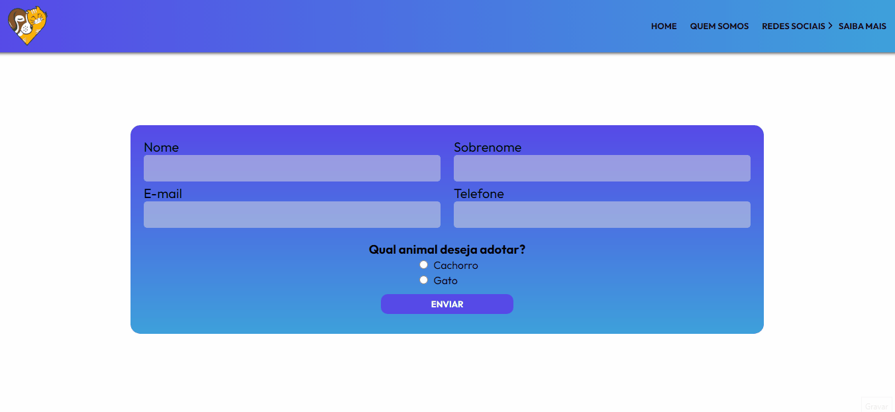
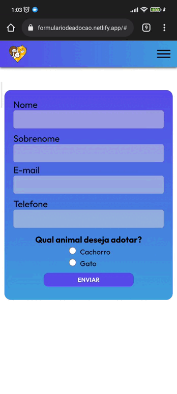

<h1 align="center">Formulário de adoção</h1>

  Uma ideia de projeto que tive, após uma aula do curso <a href="https://b7web.com.br/fullstack/?ref=I24108426I&gclid=Cj0KCQiAosmPBhCPARIsAHOen-Ok6NjukCe_t4hpZQXuHDsasW2RB7P_Bg-EC33lMWiGKo61iPecI1gaAkm9EALw_wcB"> B7WEB</a> com o professor <a href="https://www.youtube.com/c/BoniekyLacerdaLeal">Bonieky Lacerda</a>, de manipulação de elementos com JavaScript.
  Então fiz esse formulário de adoção de cães e gatos, não é um sistema funcional apenas demonstrativo.

---

<h4 align="center">Desktop</h4>
 

  

---

 
<h4 align="center">Mobile</h4>

  

---

 

### Status:

Finalizado

 

### Acesse a página <a href="https://formulariodeadocao.netlify.app/#">aqui</a>

---

 

### Autor:

Johnatan Barbosa🚀

### Espero que goste, entre em contato 📱

